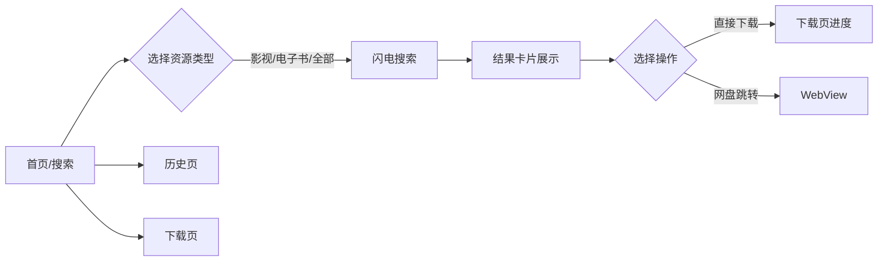

## 1. Product Overview
大神搜是一款专为资源搜索优化的Android应用，整合网盘资源搜索与在线下载功能，支持多源并行搜索，目标用户为需要快速获取影视、电子书等资源的用户群体。
- 解决现有搜索结果杂乱、加载慢、无下载进度可视化的问题
- 目标是打造业内最快、视觉最有冲击力的资源搜索工具

## 2. Core Features

### 2.1 Feature Module
1. **搜索页**: 闪电般的搜索体验，精美的结果卡片，分类切换
2. **历史页**: 搜索历史记录，一键重搜
3. **下载页**: 实时下载进度，卡片式管理，美观的状态指示
4. **自定义图标**: 体现"大神、搜索、快速、闪电"的品牌视觉

### 2.3 Page Details
| Page Name | Module Name | Feature description |
|-----------|-------------|---------------------|
| 搜索页 | 闪电搜索栏 | 渐变背景，发光搜索框，流畅动画 |
| 搜索页 | 结果卡片 | 霓虹边框，hover效果，智能排序 |
| 下载页 | 进度卡片 | 动态进度条，状态切换动画，下载速度显示 |
| 全局 | 底部导航 | 现代玻璃拟态设计，平滑切换过渡 |

## 3. Core Process
用户打开应用 → 选择分类输入关键词 → 闪电般的快速搜索 → 浏览结果卡片 → 点击下载或跳转网盘 → 在下载页查看进度 → 随时从历史页回顾

## 4. User Interface Design
### 4.1 Design Style
- **主色调**: 渐变紫色（#7F5DFE → #5B21B6）+ 闪电黄色（#FFE066）+ 暗黑背景（#0F0F23）
- **辅助色**: 青色（#06B6D4）、洋红（#EC4899）、霓虹渐变边框
- **按钮风格**: 圆角+霓虹发光、玻璃拟态、闪电图标
- **字体**: Roboto 无衬线 + 几何图形，大标题带闪电 emoji
- **布局风格**: 卡片式布局，错落有致，玻璃拟态组件，暗黑模式优先
- **图标/emoji**: 闪电⚡、搜索🔍、王冠👑、下载📥，全部自定义SVG

### 4.2 Page Design Overview
| Page Name | Module Name | UI Elements |
|-----------|-------------|-------------|
| 搜索页 | 闪电搜索栏 | 渐变背景，发光边框，输入时动画，一键清空 |
| 搜索页 | 分类标签 | 滑动选择，选中状态霓虹效果 |
| 搜索页 | 结果卡片 | 玻璃拟态，悬停上浮，来源标签，进度条 |
| 下载页 | 下载列表 | 动态进度，完成/失败状态动画，大小显示 |
| 全局 | 底部导航 | 霓虹图标，选中状态发光渐变 |

### 4.3 Responsiveness
- 移动端优先，适配 1080P/2K 屏幕
- 触摸优化，按钮高度 ≥ 48dp
- 不同屏幕尺寸合理的字体和间距缩放

### 4.4 应用图标设计
- **核心概念**: 闪电、王冠、搜索、速度
- **主视觉**: 王冠顶部伸出闪电，背景渐变紫
- **风格**: 现代科技感，霓虹发光，几何图形
- **配色**: #7F5DFE + #FFE066 + 黑色背景
- **细节**: 闪电高光，王冠轮廓发光
