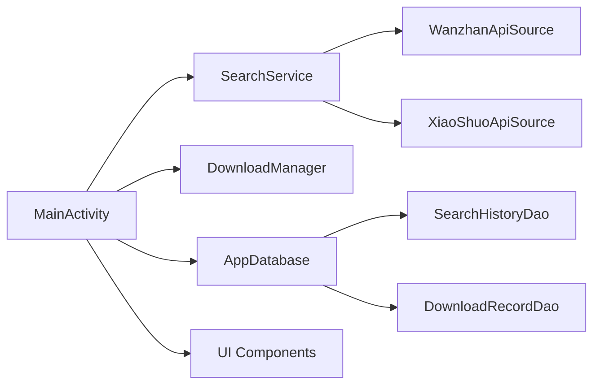

## 1. Architecture Design


## 2. Technology Description
- **Frontend**: Android Native (Kotlin)
- **UI Toolkit**: Android XML Layout + Material Components + Custom Drawable
- **State Management**: Kotlin Coroutines + LiveData/Flow
- **Database**: Room (SQLite wrapper)
- **Network**: OkHttp + Kotlin Coroutines
- **Build**: Gradle 8.5

## 3. Tech Stack
- **Language**: Kotlin 1.9
- **Min SDK**: Android 8.0 (API 26)
- **Target SDK**: Android 14 (API 34)
- **Architecture**: MVVM + Repository Pattern
- **Key Libraries**: Room, OkHttp, Material Design Components

## 4. UI Component Design
### 4.1 Custom Drawables
- **Neon Glow Button**: XML shape with gradient stroke + blur effect
- **Glass Card**: Shape with semi-transparent background + shadow + corner radius
- **Lightning Icon**: Custom SVG for search, crown, lightning elements
- **Progress Indicator**: Animated gradient progress bar

### 4.2 Animation
- **Search Bar Glow**: Animated background gradient when searching
- **Card Hover**: Elevation + scale animation
- **Page Transition**: Slide in + fade
- **Download Progress**: Smooth animating progress bar

## 5. Colors.xml
```xml
<color name="primary">#7F5DFE</color>
<color name="primary_dark">#5B21B6</color>
<color name="accent">#FFE066</color>
<color name="accent_secondary">#06B6D4</color>
<color name="neon_magenta">#EC4899</color>
<color name="bg_dark">#0F0F23</color>
<color name="bg_card">#1A1A3C</color>
<color name="glass">#33FFFFFF</color>
```

## 6. Resource Structure
- **drawable/**: Custom shapes, backgrounds, icons
- **mipmap-*/**: App icons (foreground + background)
- **values/**: colors, dimens, strings, styles
- **layout/**: activity, item layouts
